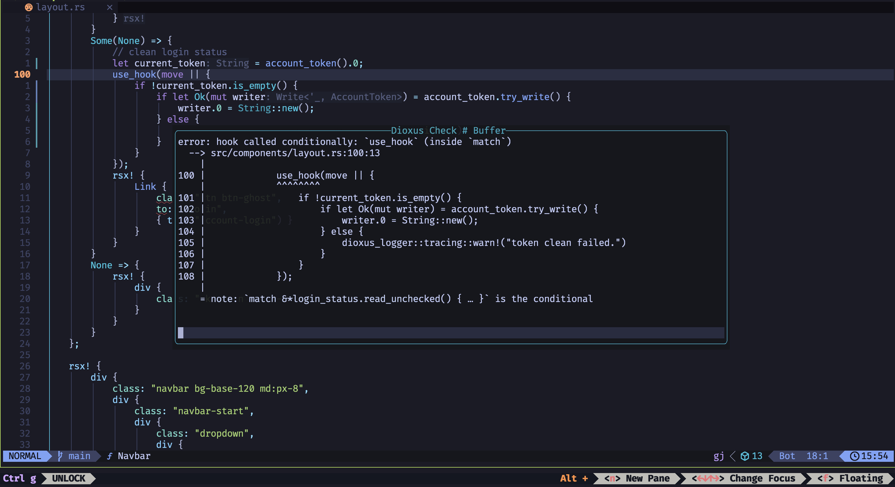

# dioxus.nvim

> Dioxus Neovim Plugin

## Features

- Translate HTML to rsx
- Format rsx code block
- Check Dioxus code



## Installation

### Lazy.nvim

```lua
{
  "mrxiaozhuox/dioxus.nvim",
  opts = {
    format = {
      split_line_attributes = true,
    },
  },
  ft = "rust",
},
```

## Commands

- `DxFormatBuffer`
- `DxFormatInline`
- `DxTranslateInline`
- `DxTranslatePrompt`
- `DxCheckBuffer`
